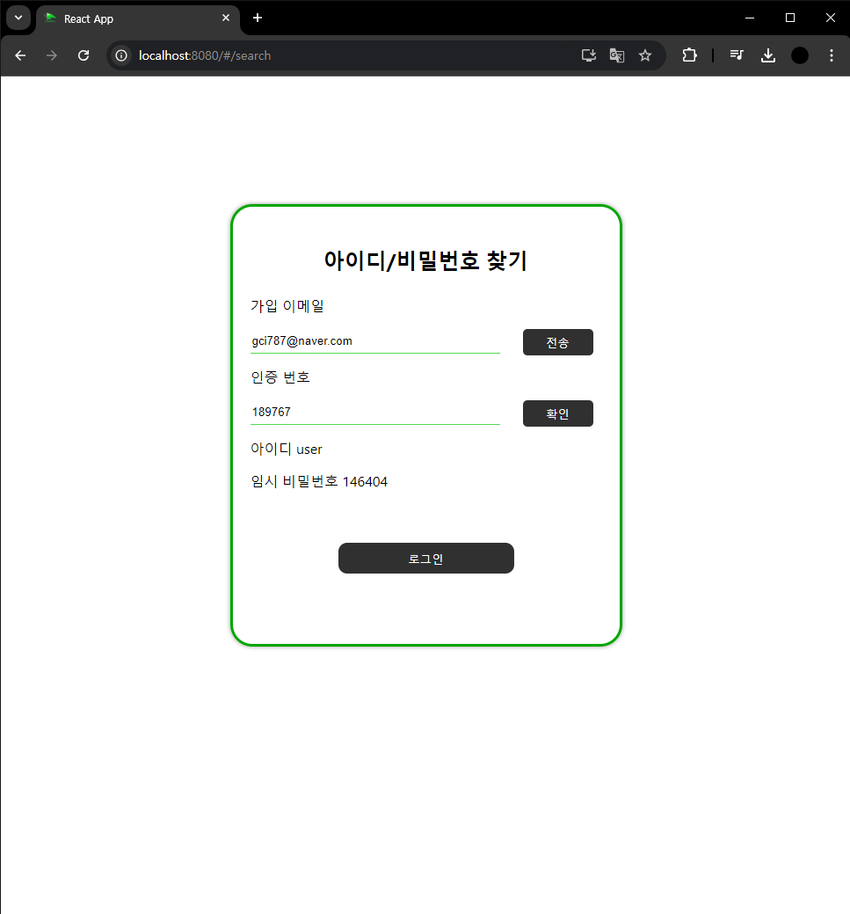
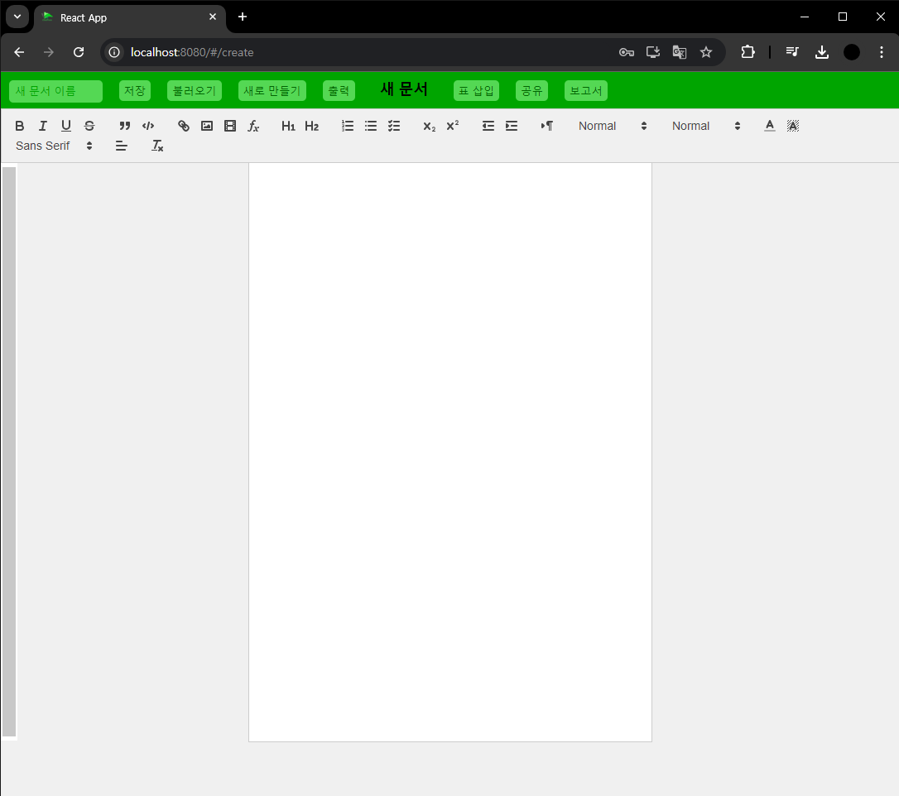
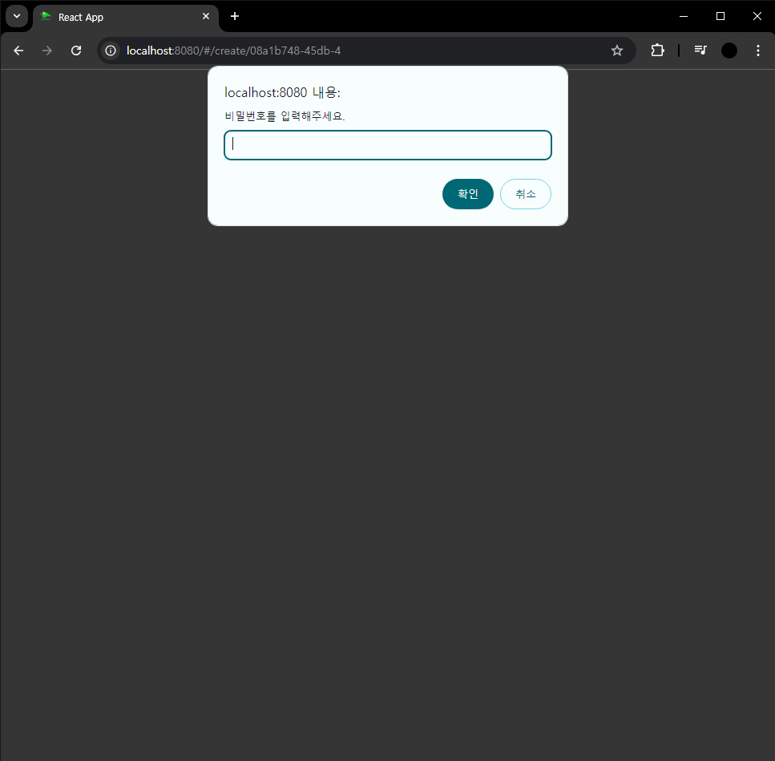

# ChatPress

## 프로젝트 개요
평소 문서 프로그램을 사용하게 되는 경우가 많습니다. 문서 프로그램을 사용하기 위해서는 
사용하는 컴퓨터마다 설치해야 되며, 소속된 기관에 따라 프로그램을 설치해야 됩니다. 
또한 모바일 기능을 지원하는 프로그램도 있지만, 그렇지 않은 경우 컴퓨터로만 확인할 수 있다는 불편함이 있습니다. 
이러한 불편함을 해결하고자, 모바일과 PC 환경을 가리지 않고 사용할 수 있는 문서 편집 사이트를 만들게 되었습니다. 
[ChatPress BackEnd](https://github.com/goshin1/ChatPress)

## 기술 스택
* React
* Spring boot
  - Spring Security
  - Google SMTP
  - WebSocket
* Html
* Javascript
* Css
* Mysql

## 구조

## 구현 내용
 

로그인 페이지로 회원가입 페이지 이동 및 아이디 및 비밀번호 찾기 페이지로 이동이 가능합니다.  

|회원가입|약관동의|
|---|---|
 | 

회원가입 페이지입니다. 아이디는 중복확인을 해야하며, 사이트내에 사용할 이미지를 업로드 해야합니다. 
또한 약관 동의 및 이메일 인증을 해야 회원가입이 가능합니다.  

 
아이디, 비밀번호를 잊어버린 경우 회원가입 때 가입한 이메일로 인증메일이 보내집니다. 메일에서 암호를 확인한 후  
인증을 하면, 임시 비밀번호와 함께 아이디를 제공합니다.  

 
메인페이지로 접속하면 채팅 화면이 나옵니다. 여기서 다른 사용자와 소통을 지원하고 메뉴 버튼을 통해 정보수정, 문서 편집 페이지로 이동할 수 있습니다.  

 
메뉴로 상단에는 방생성 입력란이 있으며 그 아래로는 참여중인 채팅 방 목록이 나옵니다. 현재 참여중인 채팅방은 배경색을 통해 구분할 수 있습니다. 
하단에는 페이지 이동 버튼이 있습니다.  

|초대하기|받은초대|
|---|---|
 | 

초대 버튼틀 누르면 초대할 사용자의 아이디 입력란이 나옵니다. 상대방의 아이디를 입력하여 초대할 수 있으며 
초대받은 사용자는 오른쪽 사진처럼 팝업창이 나오며 수락할 경우 해당 채팅방에 참여하게 됩니다.  

 
멤버 버튼을 누르면 현재 참여중인 멤버들을 확인할 수 있습니다.  

 
참여중인 버튼을 나가는 경우 알림창에서 확인 버튼을 누르면 바로 나가집니다.  

 
정보수정 페이지에서는 회원가입에서 기입한 정보를 수정할 수 있습니다. 이때 변경하기 위해서는 이메일 인증을 해야 합니다.  

 
문서편집 페이지입니다. 최상단 메뉴에서는 문서를 저장 불러오기 및 출력 등 문서 자체에 관한 기능이 있으며, 하단 메뉴는 문서 작성에 관련된 기능이 있습니다.  

|이미지 삽입|이미지 크기 조정|
|---|---|
 | 

이미지를 삽입하면 사진처럼 업로드됩니다. 이때 이미지를 클릭하면 크기 조정 입력란이 나오며, 입력하고 나면 옆에 사진처럼 크기가 변경됩니다.  

 
사용자의 편의를 위해 보고서 양식을 제공하여 버튼을 누르면 사진처럼 보고서 양식이 입력됩니다.  

 
불러오기 버튼을 누르면 문서 목록을 확인할 수 있으며 공유 버튼을 누르면 해당 문서의 공유 주소를 확인할 수 있으며,  
삭제 버튼을 통해 문서를 삭제할 수 있습니다. 채팅방에서도 해당 기능을 사용할 수 있으며, 채팅방에서는 해당 주소가 채팅방에 전송됩니다.  

 
출력 버튼을 누르면 현재 작성 중인 문서를 출력할 수 있습니다.  

|문서 비밀번호 설정|잠긴 문서 공유|
|---|---|
 | 

문서를 처음 저장하는 경우 비밀번호 입력란이 나오며 여기서 입력한 비밀번호는 문서 공유 시 입력을 해야 해당 문서 내용을 확인할 수 있습니다. 

